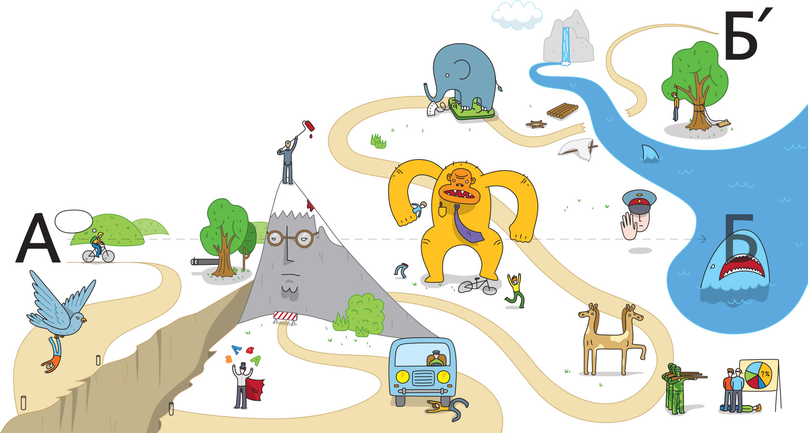

**ФФФ** (fix time, fix budget, flex scope) — принцип управления проектами, сформулированный [Бюро Горбунова](https://bureau.ru). Суть: фиксируем сроки и бюджет, а функциональность оставляем гибкой — отрезаем то, что не успеваем сделать.

## Закон о потерях

Нельзя реализовать задуманный проект за 100% времени, 100% денег, со 100%-й функциональностью и без потери качества. При отклонении от идеального плана приходится чем-то жертвовать.

Проект — это путешествие из точки А в точку Б, полное неожиданностей: дизайнер забывает учесть сложный случай, клиенту не нравится дизайн, программистов тормозит реализация, кто-то заболевает. В каждом проекте свои сюрпризы.

## Что фиксируем, что флексим

| Параметр | Решение | Обоснование |
|----------|---------|-------------|
| **Срок** | Фиксируем | Время невосполнимо. Отодвинуть запуск нельзя, даже если не успел |
| **Бюджет** | Фиксируем | Решение проблем деньгами = доп. время или расширение команды. Оба варианта ухудшают проект |
| **Качество** | Не трогаем | Репутация зарабатывается годами, теряется за день |
| **Функции** | Флексим | Методом исключения — жертвуем функциональностью |

## Почему флекс — это удача

- Продукт раньше начинает работать, зарабатывать деньги, расширять аудиторию.
- Меньше функций → меньше пересечений → меньше мест для ошибки → выше качество первой версии.
- Открытый вовремя продукт помогает быстрее проверить гипотезы. Возможно, убранная функция никогда и не понадобится.
- Продукт с небольшим числом функций проще объяснить пользователям.
- Отложенная функция во второй версии — это информационный повод рассказать о продукте.

## Боль флекса

Флексить страшно и больно всем: дизайнерам (классная фишка не попадёт в продукт), разработчикам (потраченные силы на отладку), клиенту (оправданные ожидания). Но проект больше похож на экспедицию Колумба с бунтами и штормами, чем на стандартизованную доставку апельсинов.

## Принципы работы

### Клиент — предприниматель

Работаем напрямую с тем, кто принимает все решения (обычно директор компании). Не берёмся за проект, где больше одного командира — попытка угодить нескольким «клиентам» даёт беззубый компромиссный продукт.

### Результат — это пуск

Дизайн не заканчивается на картинках. Большинство решений принимается на этапе разработки: что произойдёт при незаполненной форме, как выглядит 404 при ширине 2000px, что делать с реальными данными в три раза больше предусмотренного. Дизайнерское управление разработкой гарантирует, что программисты работают на проект, а не на ТЗ и баг-трекер.

### Регулярные пуски

Большой проект разбивается на короткие итерации. Результат каждой — пуск полезной функциональности. Длинные проекты расслабляют в начале и демотивируют в конце; ритмичные пуски держат команду в тонусе и позволяют скорректировать курс.

### Никаких сюрпризов

Понедельный план от начала до пуска. Ведущий дизайнер отвечает за пуск. Самый страшный грех — принести клиенту в последний день половину проекта и поставить перед фактом. Решение о конкретном способе флекса принимаем **вместе с клиентом**.

## Связь с другими методологиями

ФФФ — это не фреймворк вроде [Scrum](./scrum.md) или [Kanban](./kanban.md), а принцип принятия решений при отклонении от плана. Он хорошо сочетается с итеративным подходом и близок по духу к [Agile](./agile.md): ранний пуск, проверка гипотез, адаптация. В отличие от классического треугольника проекта (время–деньги–качество), ФФФ явно фиксирует, чем именно жертвуют — функциональностью, а не качеством.

## Краткие ответы на частые вопросы

- **Часто ли приходится жертвовать функциональностью?** Всегда. Флекс — часть любого проекта, не исключение.
- **Можно ли заложить достаточно времени?** Берём запас по принципу «не впритык», но гарантий нет.
- **Будут ли доделаны отложенные функции?** Возможно, но курс может измениться по итогам пуска. Продолжение — отдельная итерация.
- **Не «жертвовать качеством» ли это?** В первом iPhone не было диктофона, видео и буфера обмена. Но то, что было, сделано на отлично.
- **Одна функция хорошо или две сырые?** Лучше одна отлаженная. Тормоза и глюки создают впечатление ненадёжного продукта.

## Материалы и источники

- [ФФФ — Бюро Горбунова](https://bureau.ru/about/fff/)
- [Дизайнерское управление разработкой](https://bureau.ru/about/development/)
- [Совет: Не впритык](https://bureau.ru/soviet/20130909/)
- [Совет: Лучше недообещать](https://bureau.ru/soviet/20130902/)
